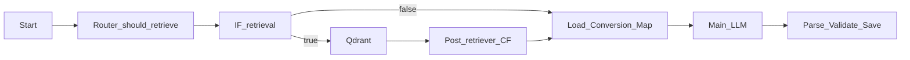

# Фаза 1 (детально): логика AgentFlow v2 + репозиторий

Документ описывает **только первый этап** из общего плана выката v2.0: что сделать в **Flowise**, что синхронизировать в **файлах репозитория**, в каком порядке и как проверить.

**Вне scope фазы 1:** новый дизайн виджета (фаза 2), Postgres/Metabase/backend логов (фаза 3).

---

## 1. Цели фазы 1

После завершения фазы 1 должно выполняться:

1. **Один основной LLM** за ход с предсказуемым **JSON** на выходе (без отдельного Intent Classifier).
2. **Тон ответа** — простая «карта настроений»: поле `tone` + правила в промпте (в первую очередь одна короткая вводная фраза).
3. **CTA** — один общий набор + **несколько вариантов текста** с привязкой к `meta_subtopic` (через conversion map и/или поле в JSON).
4. **До двух тестовых видео** в conversion map на **двух разных** `topic+subtopic`.
5. **Кнопка «Рассказать о своей ситуации»** + сценарий с **«Назад к диалогу»**, **TTL = 1 ход**, без RAG на шаге ожидания текста — по [info/bot_behaviors_from_logic.v1.md](bot_behaviors_from_logic.v1.md) §4.2.
6. **Жёсткий лимит:** не больше **3 интерактивных кнопок** за ответ **включая CTA**; **конверсия** (видео или «ситуация») только если **`followup_options.length ≤ 1`**.
7. **Сброс памяти навигации** (`covered_subtopics`) при смене **`meta_topic` / `meta_subtopic`**, чтобы кнопки не «умирали» после перехода в другую подтему.

---

## 2. Опорные документы в репозитории

| Файл | Роль |
|------|------|
| [info/bot_behaviors_from_logic.v1.md](bot_behaviors_from_logic.v1.md) | Архитектура поведения: кнопки, CTA, видео, «ситуация» (§4). |
| [info/prompt.mvp.md](prompt.mvp.md) | System prompt + описание JSON для LLM. |
| [info/parse_validate_save.mvp.js](parse_validate_save.mvp.js) | Код для ноды **Parse + Validate + Save** в Flowise (копипаст). |
| [info/architecture.current.qdrant-test.md](architecture.current.qdrant-test.md) | Ориентир по типовому графу (Start → Router → IF → RAG → … → Parse). |
| [info/bot.md](bot.md) | Как устроен прод (nginx, API); для фазы 1 — контекст, не обязательно менять. |

---

## 3. Типовой граф AgentFlow (что должно быть в Flowise)

Логическая цепочка (имена нод могут отличаться):

**Важно:** если у вас после квиза был отдельный обход LLM — в v2 без квиза ветка «short-circuit» не нужна, если только не добавите отдельную ноду для `situation_pending` **до** Router (см. §6).

---

## 4. Ключи `$flow.state` (минимальный набор)

Добавьте в **Start** то, чего ещё нет; остальное обновляет Parse/Router.

| Ключ | Назначение |
|------|------------|
| `leadIntent` | `none` \| `awaiting_name` \| `awaiting_phone` \| `complete` |
| `meta_topic`, `meta_subtopic` | Тема/подтема для RAG и UX |
| `should_retrieve` | Строка `"true"` / `"false"` (как у вас принято в IF) |
| `last_context` | JSON контекста после пост-обработки retriever |
| `message_count`, `covered_subtopics` | Антифлуд и память followup по документу |
| `situation_pending` | `true` пока ждём **один** ввод комментария после оффера «ситуация» |
| `situation_note` | Сохранённый короткий комментарий (для заявки позже) |
| `situation_offer_shown` | Строка-ключ (`meta_topic__meta_subtopic`), чтобы не показывать оффер «ситуация» повторно для той же пары; при смене темы/подтемы Parse сбрасывает |

При смене `meta_topic` / `meta_subtopic` Parse должен **очистить** `covered_subtopics` (и при необходимости пересмотреть ключ оффера «ситуация»).

---

## 5. JSON-контракт ответа LLM (за один ход)

Зафиксировать в [info/prompt.mvp.md](prompt.mvp.md) и держать в **structured output** ноды LLM.

**Обязательные поля (база):**

- `answer` — текст пользователю.
- `ui_ctaIntent` — `booking` \| `none`.
- `leadIntent` — как в state.
- `meta_shouldHandoff` — boolean.
- `meta_topic`, `meta_subtopic`.
- `followup_options` — массив строк (заголовки `###` из текущего документа).
- `turn_type`, `should_retrieve` — как сейчас в промпте.
- `tone` — `default` \| `supportive` (финально детерминировано Parse по `meta_topic`).
- `conversion` — объект с **`video`** (`title`, `url`); при появлении сценария «ситуация» в JSON может быть флаг или отдельное поле, но **показ** кнопки «ситуация» надёжнее дублировать/дожимать в **Parse** по правилам [bot_behaviors_from_logic.v1.md](bot_behaviors_from_logic.v1.md) §4.2 (чтобы LLM не забыла).

**CTA-текст (выберите один подход и зафиксируйте):**

- **Вариант A:** LLM возвращает `cta_label` строго из whitelist (список в промпте + map по subtopic в промпте).
- **Вариант B:** текст CTA **не** в JSON; виджет показывает фиксированную подпись, а персонализация только через conversion map в промпт-контексте (меньше контроля на фронте).

Рекомендация для v2: **вариант A** или явная строка `cta_label` из 3–6 заранее одобренных фраз.

**Гарантия лимита кнопок:** **Parse** обрезает followup до **2**; при **≥2** кнопках видео из `VIDEO_MAP` не подставляется (см. §7).

---

## 6. Сценарий «Рассказать о своей ситуации» (пошагово)

Источник правил: [info/bot_behaviors_from_logic.v1.md](bot_behaviors_from_logic.v1.md) §4.2. Ниже — логика реализации.

### 6.1 Условия показа оффера (кнопка в ответе)

Оффер показываем только если одновременно:

- `leadIntent === none`
- `meta_topic === implantation` (если решите расширить — обновите спеку)
- после нормализации `followup_options.length <= 1`
- оффер ещё не показывали для текущего ключа (`topic+subtopic` или `topic`)

**Представление в UI:** отдельная кнопка с **фиксированным** текстом, например `Рассказать о своей ситуации`. Клик отправляет в чат **ровно этот же текст** (как сообщение пользователя), чтобы Parse мог распознать без NLP.

### 6.2 Клик по офферу

1. Parse (или предшествующая маленькая CF **до** LLM) распознаёт сообщение = триггер оффера.
2. Выставить `situation_pending = true`.
3. Сформировать ответ **без вызова основного LLM** или с минимальным шаблоном (на выбор архитектуры):
   - **Предпочтительно:** отдельная ветка **до** Router: Custom Function возвращает готовый JSON ответа (как после Parse), минуя RAG и LLM — тогда не нужно «уговаривать» модель.
   - **Проще в графе, но хуже:** один LLM с жёстким промптом «только приглашение» — риск отклонения от текста.
4. Текст приглашения (зафиксированный):  
   «Хорошо. Коротко опишите вашу ситуацию — что сейчас беспокоит или в чём сомневаетесь. Мы передадим это администратору перед тем, как связаться с вами.»
5. В `followup_options` в этом сообщении — **одна** кнопка: `Назад к диалогу` (или эквивалентный фиксированный текст).
6. **Retrieval:** `should_retrieve = false` пока `situation_pending` (Router + Parse согласованы).

### 6.3 Следующий ход пользователя

- Если сообщение = **«Назад к диалогу»** (точное совпадение после нормализации):  
  - `situation_pending = false`  
  - не писать `situation_note`  
  - вернуть обычный режим (далее Router/LLM по правилам).

- Иначе считаем это **комментарием**:  
  - сохранить в `situation_note` (обрезка по длине, напр. 500–1000 символов)  
  - `situation_pending = false`  
  - выставить `leadIntent = awaiting_name` (или ваш следующий шаг воронки)  
  - ответ модели — короткий переход к сбору имени (через LLM или шаблон).

### 6.4 TTL = 1 ход

После приглашения ровно **один** пользовательский ход обрабатывается как «назад» или «комментарий». Если нужна повторная попытка — это отдельное продуктовое решение (в [bot_behaviors_from_logic.v1.md](bot_behaviors_from_logic.v1.md) §4.2 зафиксирован строгий TTL).

---

## 7. Parse + Validate + Save — порядок операций

Файл-эталон: [info/parse_validate_save.mvp.js](parse_validate_save.mvp.js). Логику дополнять **в таком порядке**:

1. **Смена темы:** сравнить предыдущие `meta_topic`/`meta_subtopic` из state с валидированными новыми; при изменении — `covered_subtopics = []` (или новый scoped-объект, если позже решите хранить по ключу).

2. **Режим `situation_pending`:**  
   - если вход пользователя — «Назад…» / триггер оффера / комментарий — обработать по §6 **до** применения followup-фильтров из старого списка `covered_subtopics`;  
   - принудительно `should_retrieve = false`; очистить лишние поля ответа.

3. **Парсинг JSON LLM** как сейчас: `answer`, `leadIntent`, `followup_options`, `conversion`, `tone`, …

4. **Лимит followup:** максимум **2** строки в `followup_options` (чтобы место осталось под одну конверсию и CTA = 3 кнопки). Если в спеке CTA не считается «кнопкой followup» в JSON — уточните в виджете; в продуктовой спеке CTA **входит** в лимит 3.

5. **Конверсия:**  
   - если `followup_options.length >= 2` — обнулить «вторую конверсию» в широком смысле: не показывать ни видео, ни «ситуацию» в этом ходе (кроме случаев, когда сценарий «ситуация» уже в пункте 2).  
   - если `== 1` — максимум **одна** из: видео **или** оффер «ситуация» (решите приоритет: обычно видео из map **или** «ситуация» для имплантации — зафиксируйте в спеке).

6. **Обновление `covered_subtopics`** по клику подтемы (как сейчас).

7. **Запись в `$flow.state`** всех полей, которые читает Router на следующем ходе.

8. **Антифлуд** (как сейчас).

9. `return JSON.stringify(validated)`.

---

## 8. Router (Custom Function)

Условие вывода `"true"` / `"false"` для retrieval (адаптируйте под ваш скрипт):

- `leadIntent !== "none"` → retrieval **выкл**.
- `situation_pending === true` → retrieval **выкл**.
- Иначе — как в текущей логике (`should_retrieve` от LLM или дефолт).

Обновление state `should_retrieve` — как у вас уже настроено (часто запись `{{ output }}` в state).

---

## 9. Load Conversion Map (опционально)

**Можно не держать в графе:** те же карты **вшиты в Parse** после `node scripts/sync-maps.js`; для виджета достаточно обновлять **Parse**.

Отдельная нода **Custom Function** имеет смысл только как подсказка в промпт LLM: по `last_context` выбирает ключ `topic__subtopic` или `default`, отдаёт JSON с `cta_label` / `video`. Тогда в System-промпте остаётся плейсхолдер вида `{{customFunctionAgentflow_1}}` (см. [info/prompt.mvp.md](prompt.mvp.md) §5 — опциональный блок).

Если ноду убрали — в промпте **не** оставляй мёртвый плейсхолдер; расширять объект в `load_conversion_map.mvp.js` нужно только если эту ноду снова включаете в граф.

---

## 10. Простая «карта настроений» (tone)

1. В **metadata** чанков в Qdrant (где уместно) — поле `tone`: `neutral` | `supportive` | `service`.
2. В промпте — правило: **не больше одной** короткой «вводной» по тону, дальше только факты из базы; `service` для контактов/организации.
3. LLM возвращает `tone` в JSON; Parse валидирует enum (как уже для `ALLOW_TONE`).

При конфликте нескольких чанков — приоритет тона/подачи задаётся в [prompt.mvp.md](prompt.mvp.md); опциональный `tone` в metadata — см. [bot_behaviors_from_logic.v1.md](bot_behaviors_from_logic.v1.md) §5.

---

## 11. База знаний (по необходимости)

- Проставить `tone` в нужных md/метаданных при индексации.
- Убедиться, что **два** выбранных для видео `subtopic` реально существуют в базе и в conversion map совпадают с ключами.

---

## 12. Чеклист приёмки фазы 1

### 12.1 Навигация и кнопки

- [ ] Документ с **2+** подтемами: в одном ответе **не более 2** followup + CTA, **без** видео и без «ситуации».
- [ ] Документ с **1** подтемой: followup + **либо** видео **либо** «ситуация» (как зафиксировали) + CTA, всего **≤ 3** кнопки.
- [ ] После перехода в **другую** `meta_subtopic` старые «раскрытые» подтемы **не** вырезают кнопки нового документа.

### 12.2 Видео

- [ ] На subtopic A показывается видео 1 (title + воспроизведение в виджете на фазе 2).
- [ ] На subtopic B — видео 2.

### 12.3 CTA

- [ ] Для разных subtopic подтягиваются **разные** допустимые тексты CTA (из whitelist / map).
- [ ] CTA всегда последняя по смыслу ответа.

### 12.4 «Ситуация»

- [ ] Оффер только при `implantation`, `leadIntent none`, `followup ≤ 1`, не чаще чем раз на ключ.
- [ ] После клика — приглашение + только «Назад к диалогу»; RAG не вызывается.
- [ ] «Назад» возвращает в обычный режим без записи комментария.
- [ ] Свободный текст сохраняется в `situation_note`, затем переход к `awaiting_name` (или выбранный шаг).

### 12.5 Воронка и RAG

- [ ] При `leadIntent !== none` retrieval выключен.
- [ ] Handoff и антифлуд не регрессировали.

---

## 13. Выходные артефакты фазы 1

- Обновлённый **AgentFlow** в Flowise (экспорт по желанию; эталон — рабочий инстанс).
- Актуальные **[info/prompt.mvp.md](prompt.mvp.md)** и **[info/parse_validate_save.mvp.js](parse_validate_save.mvp.js)**.
- При расхождениях — правки в **[info/bot_behaviors_from_logic.v1.md](bot_behaviors_from_logic.v1.md)**.
- Короткая заметка «какой приоритет: видео vs ситуация при одном followup» — если ещё не зафиксировано в §3.

После этого можно переходить к **фазе 2** (виджет) с замороженным JSON и поведением кнопок.
